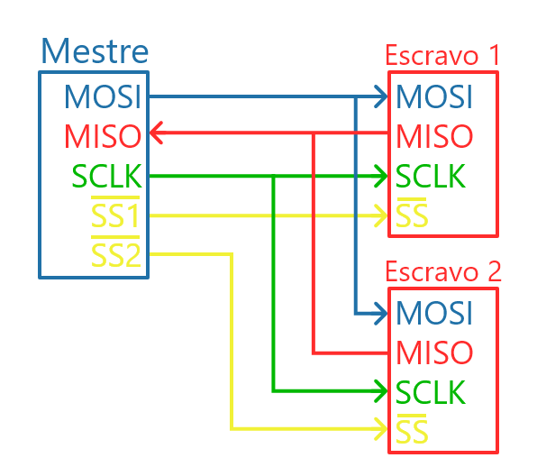

# Controlador SPI Slave/Peripheral (Multimodo)

## História do SPI

O barramento **SPI (Serial Peripheral Interface)** foi desenvolvido pela **Motorola** no final da década de 1980 como uma forma simples e eficiente de comunicação serial síncrona entre microcontroladores e periféricos. Diferentemente de outros protocolos como I2C, o SPI não possui controle de endereço ou detecção de colisões, o que o torna **mais rápido e com menor overhead**.

Graças à sua flexibilidade e velocidade, o SPI se tornou amplamente adotado em aplicações embarcadas, como sensores, memórias flash, displays OLED, conversores A/D, e módulos de comunicação. Sua popularidade o transformou em um padrão de fato, mesmo sem uma padronização oficial formal.

O SPI opera com um Master e um ou mais Slaves. O mestre é responsável por gerar o sinal de clock (`SCK`) e controlar o fluxo da comunicação por meio do sinal de seleção de chip (`CS`). Os dados são transmitidos de forma síncrona, com envio Master Out Slave In (`MOSI`) e  recepção Master in Slave Out (`MISO`) ocorrendo simultaneamente.

Na figura abaixo podemos ver um exemplo de ligação de um Master com dois Slaves. Nele, os sinais `MOSI` e `MISO` são ligados diretamente nos dois Slaves enquanto cada Slave possui um chip select (`SS`, na figura) independente. Isso possibilita a seleção do Slave sem a necessidade de endereçamento, ao custo dos fios de seleção extras.



Recentemente, com o objetivo de tornar as nomenclaturas mais inclusivas e menos ofensivas, muitos passaram a adotar o termo Peripheral em substituição a Slave, e Controller no lugar de Master, com os termos MOSI e MISO sendo substituidos por COPI (Controller Output Peripheral Input) e CIPO (Controller Input Peripheral Output) respectivamente.

## Modos de Operação SPI

O SPI possui quatro modos de operação, definidos pelas combinações dos parâmetros **CPOL** (polarity) e **CPHA** (phase). Esses parâmetros determinam **em qual borda do clock os dados são escritos e amostrados**.

### Tabela de Modos SPI para o Slave

| Modo | CPOL | CPHA | Borda de leitura (MOSI) | Borda de escrita (MISO) |
| ---- | ---- | ---- | ----------------------- | ----------------------- |
| 0    | 0    | 0    | Subida                  | Descida                 |
| 1    | 0    | 1    | Descida                 | Subida                  |
| 2    | 1    | 0    | Descida                 | Subida                  |
| 3    | 1    | 1    | Subida                  | Descida                 |

---

## Objetivo

Neste laboratório, você irá implementar um **controlador SPI Slave** em Verilog, configurável para operar nos 4 modos descritos acima. O SPI Slave deve ser capaz de receber dados do Master e responder com dados previamente carregados.


## Módulo SPI Slave

```verilog
module SPI_Peripheral #(
    parameter SPI_BITS_PER_WORD = 8,
    parameter SPI_MODE          = 0           // 0: CPOL=0, CPHA=0; 1: CPOL=0, CPHA=1; 2: CPOL=1, CPHA=0; 3: CPOL=1, CPHA=1
) (
    input  wire clk,   // Clock do sistema
    input  wire rst_n,

    input  wire sck,
    input  wire cs,    // Ativo em nível lógico baixo
    input  wire mosi,
    output wire miso,

    input  wire [SPI_BITS_PER_WORD-1:0] data_in,
    input  wire data_in_valid, // Indica que há dado pronto para enviar

    output reg  data_out_valid, // Ativo por 1 ciclo ao término da recepção
    output reg  [SPI_BITS_PER_WORD-1:0] data_out,
    output reg  busy
);
    // Sua implementação aqui
endmodule
```


## Requisitos

1. O escravo deve detectar bordas de `sck` (respeitando `CPOL` e `CPHA`) para amostrar `mosi` e gerar `miso`.
2. A comunicação deve ocorrer apenas quando `cs` estiver em nível **baixo**.
3. O dado a ser enviado via `miso` deve ser carregado quando `data_in_valid` for alto.
4. O dado recebido via `mosi` deve ser colocado em `data_out` ao final da transação, com `data_out_valid` sendo ativado por **1 ciclo de clock**.
5. A saída `busy` deve indicar se o escravo está em comunicação ativa.

## Execução da atividade

Siga o modelo de módulo já fornecido e utilize o testbench e scripts de execução para sua verificação. Em seguida, implemente o circuito de acordo com as especificações e, se necessário, crie outros testes para verificá-lo.

Uma vez que estiver satisfeito com o seu código, execute o script de testes com `./run-all.sh`. Ele mostrará na tela `ERRO` em caso de falha ou `OK` em caso de sucesso.

## Entrega

Realize um *commit* no repositório do **GitHub Classroom**. O sistema de correção automática irá validar sua implementação e atribuir uma nota com base nos testes.

## Dicas

* Utilize uma máquina de estados finitos (FSM) para controlar os estágios de recepção e transmissão
* Faça sincronização dos sinais assíncronos (como `sck`, `cs`, `mosi`) com o clock interno `clk`
* Utilize registradores de deslocamento para manipular os dados bit a bit
* Lembre-se de respeitar a borda de clock correta (CPHA) e o nível inativo (CPOL)
* Certifique-se de que `miso` apresenta o bit correto antes da borda apropriada
